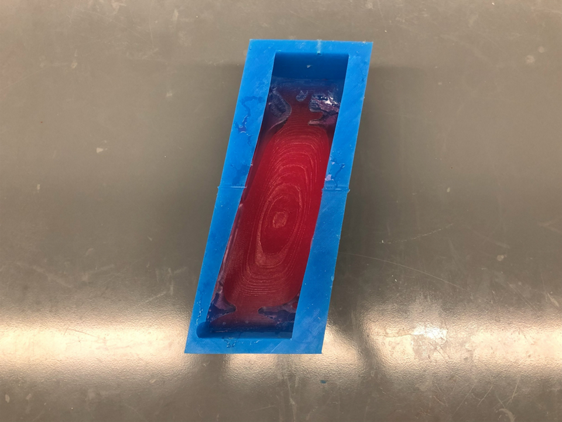
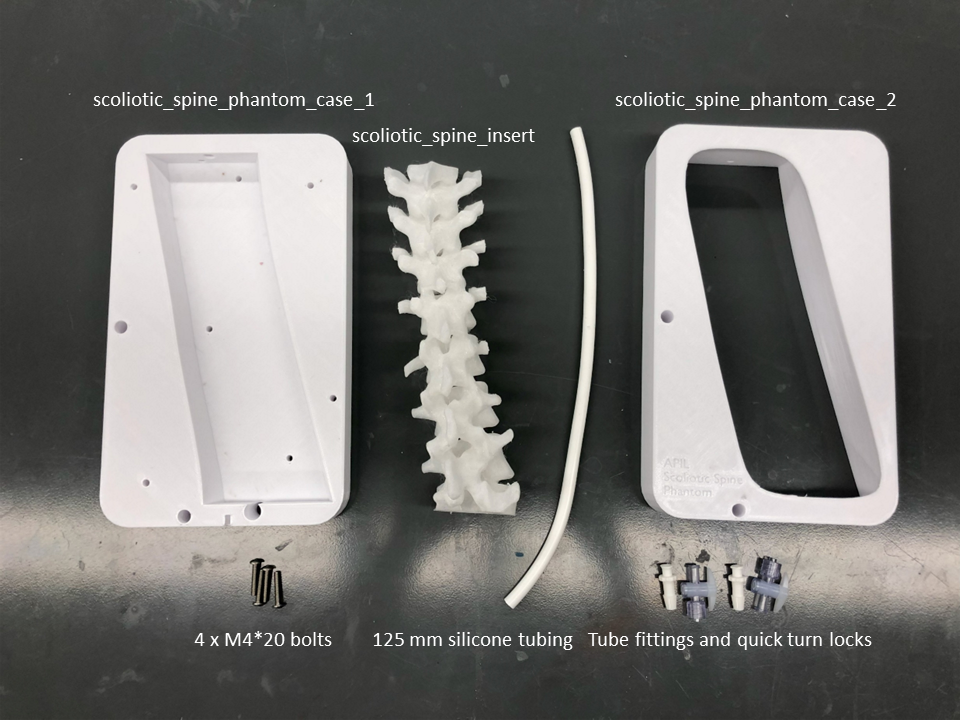

# APIL Scoliotic Spine Epidural Phantom

3D Printed thoracic and lumbar (T6 - L2) scoliotic spine based on CT data.  Our scoliotic spine phantom is encased in an synthetic, shelf-stable gel which has a realistic tactile feel to human muscle and is echogenic.  We can augment the echogenic properties to be transparent (clear gel, pictured above) to mimicing that of biological tissue (opaque) based on the learning objective. Additionally, the Scoliotic Spine Epidural Phantom contains an echogenic faux-thecal sac to replicate loss-of resistance on puncture.  The faux-thecal sca can be inflated with water to simulate spinal fluid. 

This model was developed at the [Lynn & Arnold Irwin Advanced Perioperative Imaging Lab](https://apil.ca), Toronto General Hospital, University Health Network.

# Purchasing Information
To purchase this phantom, please email <apil@uhn.ca> and a represtative will be in touch with you with more details.

**A purchased phantom contains the following**:

1. Fully assembled scoliotic spine phantom.
2. Custom table clamp to hold phantom to tabe surface

# Ultrasound Images
Coming soon

# Care and Maintenance
1. Apply generous amount of ultrasound gel to surface of phantom.
2. Inflate thecal sac with water and ensure quickturn locks are closed

# Materials & Equipment

## Hardware

- M5*14 pins
- 4 x M4*16 Bolts
- 4 x M4*20 Bolts
- Quick-turn Lock
- 8 mm ID Silicone Tubing (as low durometer as possible)
- Tube Fittings

## Printing Equipment

- Polylactic Acid (PLA)
- Bridge Nylon
- Fused Deposition Modelling 3D printer

## Casting Equipment

- Ballistics Gel
  - Gelatin #3 from [Humimic Medical](https://humimic.com/product/gelatin-3-medical-gel-by-the-pound/)
- Graphite Powder (optional)
  - used to replicate echogenic scatter of muscle
- Slowcooker
- Two-part Platinum Cure Silicone Rubber (or equivalent)
  - Available from [Smooth-On](https://www.smooth-on.com/products/dragon-skin-30/)
- Degas Chamber (Optional)

# Assembly Instructions

## Printing

This repo includes **stl** files for each printed part.

In general, we use the following settings for *all* parts of this phantom:

<table>
    <tr>
        <td><b>Material</b></td>
        <td><b>Colour</b></td>
        <td><b>Nozzle Temp (C)</b></td>
        <td><b>Bed Temp (C)</b></td>
        <td><b>Infill (%)</b></td>
        <td><b>Perimiters (#)</b></td>
    </tr>
    <tr>
        <td>PLA</td>
        <td>White</td>
        <td>210.0</td>
        <td>60.0</td>
        <td>10.0</td>
        <td>2</td>
    </tr>
    <tr>
        <td>Bridge Nylon</td>
        <td>Natural</td>
        <td>250.0</td>
        <td>80.0</td>
        <td>15.0</td>
        <td>3</td>
    </tr>
</table>

## Silicone Casting

### Silicone Mold Casting

1. Print all components in the directory */molds/* using the PLA printing settings outlined above.
2. Assemble mold parts 1, 2 and inner components together using M5*14 pins.
3. Mix **1300 g** of silicone according to manufacturers instructions.
    - Degassing the silicone is encoraged, but optional.
    - Adding colourant to silicone is optional.
4. Pour all silicone into the assembled mold.
5. Allow silicone to cure according to manufacturer's instructions.
6. Carefully disassmble the mold and release the silicone.
   - **NOTE:** This step can be very difficult.  Procede with caution and patience to avoid damaging the silicone shell.

## 3D Printing Components

1. Print all components in the directory */scoliotic_spine_insert/* using the Bridge printing settings outlined above.
2. Print all components in the directory */case/* using the PLA printing settings outlined above.
3. Carefully remove **all** supports from the part when complete.

## Ballistics Gel Casting

1. **CAUTION:** Use appropriate heat-proof gloves when working with liquefied ballistic gel and/or heat gun.
2. **CAUTION:** work **only** in a very well ventilated area.  A fumehood is *highly* recommended.

### Ballistics Gel Casting

1. Melt at least **1000 g** gel in crockpot @ 105C - 115C (approx. 225F - 240F).
2. If the gel does not contain graphite powder, slowly add graphite powder into fully liquefied mixture until saturated.
   1. For this phantom, this step is optional.  You can leave it clear if the learning objective is to insert an epidural without the use of ultrasound.
3. Thread a length of silicone tubing through the scoliotic sipne to replicate the thecal sac.  The length should be just enough to reach end-to-end of the scoliotic spine.
4. Anchor scoliotic spine insert and thecal sac silicone tube into the silicone mold with 4 x M4*16 bolts.
5. Pour gel into mold until the gel is flush with the top of the spine insert
6. Allow gel to fully cool before removal from silicone molds.
7. Remove previously installed silicone tube.
8. Install a new silicone tube measuring 125 mm.
   1. we use a longer silicone tube in this step so the ends of the tubing extend well past the case for ease of access.

## Phantom Assembly

1. Squeeze the gel and scoliotic spine through the printed lid of the case(scoliotic_spine_phantom_case_1).
2. Attach lid with the scoliotic spine to the base of the case (scoliotic_spine_phantom_case_2).
3. Thread the ends of silicone tubing through the holes provided in the base of the case
4. Join the lid and base together using 4 x M4*20 bolts.
5. Attach a tube fitting to each end of the silicone tube.
6. Attach a quick-turn lock to each end of the tube fittings.
